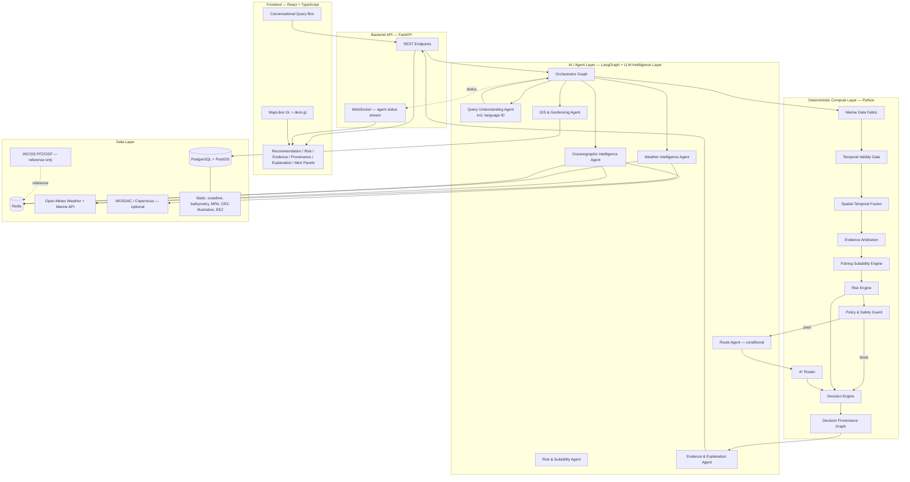
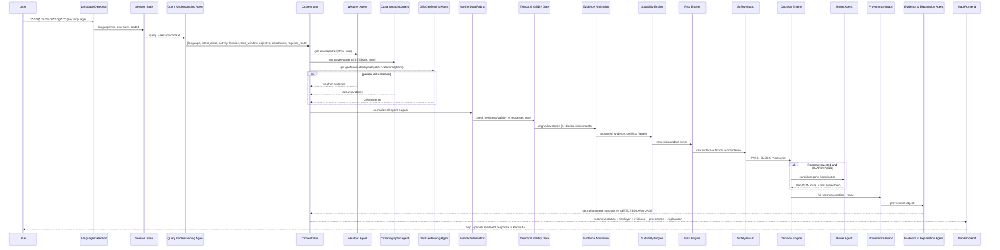
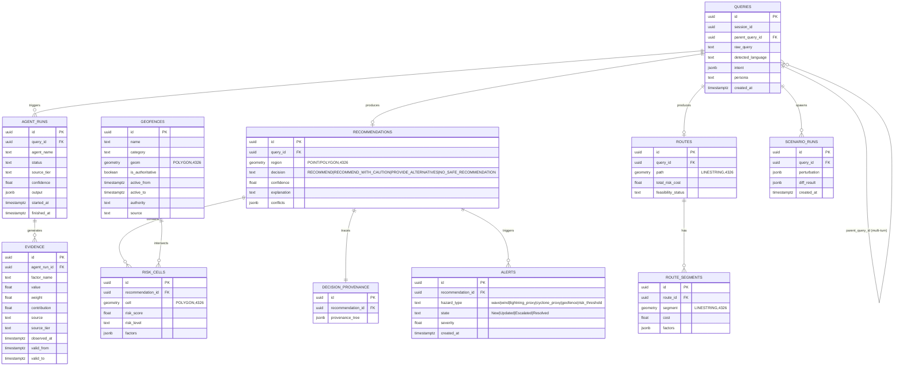
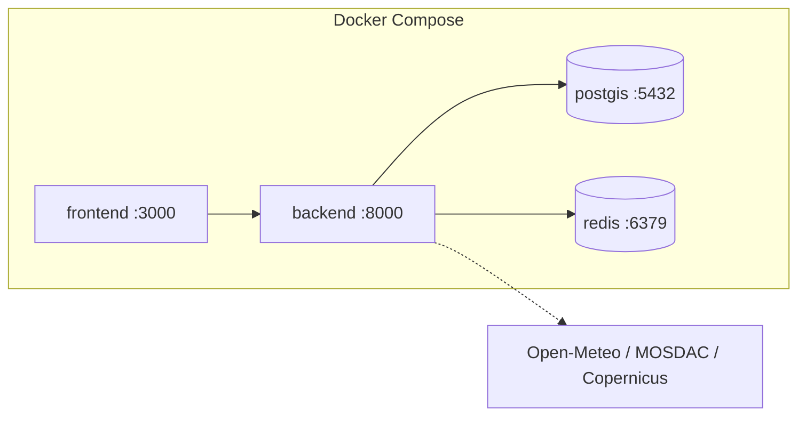
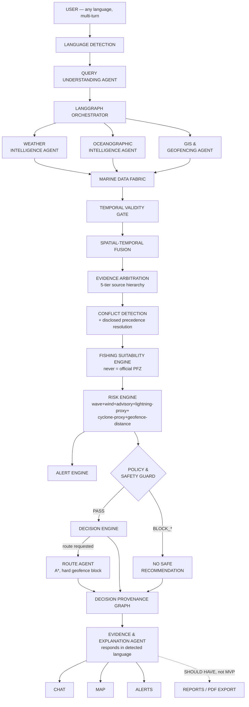

# ORCA — Marine EcOsystem Reasoning with Collaborative Agents
## FINAL HYBRID ARCHITECTURE — Single Source of Truth
**SIH26176 | Sponsor: ISRO | Theme: Disaster Management**

> This document is built by selective hybridization of `ORCA_Master_Architecture_v3.md` (governance/safety layer) and `architecture.md` (engineering/data foundation), resolved against `ORCA_Architecture_Audit_and_Final_Blueprint.md`, and re-scoped against the exact official SIH26176 problem statement. Every dataset/API claim in this document was independently verified during architecture research, not assumed. **The LLM layer is vendor-neutral (§11a) — no specific commercial provider is mandatory. LangGraph is fixed as the sole orchestration framework (§11) — no alternative is part of the MVP.** ARCHITECTURE STATUS: **FROZEN — IMPLEMENTATION READY** — see the Final Implementation Checklist (§52) and Final Architecture Decision at the end of this document.

---

## 1. Project Identity

**Name:** ORCA — Marine EcOsystem Reasoning with Collaborative Agents
**Problem Statement:** SIH26176 | **Sponsor:** ISRO | **Theme:** Disaster Management
**Type:** Software-only Agentic AI conversational platform

**One-line description:** ORCA is a conversational, agentic marine-intelligence platform that fuses satellite-derived, oceanographic, meteorological, and geospatial data through collaborative specialized agents, reasons across space and time under a deterministic safety and evidence layer, and produces explainable, provenance-traceable recommendations in the user's own language — for fishermen, researchers, coastal authorities, disaster-management agencies, and maritime operators.

**Core principle:** *AI interprets and explains → deterministic code computes and enforces safety → evidence supports every claim → the human makes the final decision.*

---

## 2. Executive Summary

ORCA is not a chatbot wrapped around a weather API. The hard problem the SIH statement describes is not data access — every dataset ORCA uses is individually retrievable — it is **reasoning across fragmented, sometimes disagreeing, sometimes missing marine data, under time pressure, in natural language, in the user's own language, safely.** ORCA solves this with 7 named agent roles (6 core agents + 1 conditionally-invoked Route Agent) behind a single conversational interface, coordinated by a LangGraph orchestrator, calling a provider-independent LLM Intelligence Layer only where language understanding and explanation are genuinely needed, feeding a deterministic reasoning core (Marine Data Fabric → Temporal Validity Gate → Spatial-Temporal Fusion → Evidence Arbitration → Fishing Suitability Engine → Risk Engine → Policy & Safety Guard → Decision Engine → Decision Provenance Graph) that the LLM narrates but never computes. The system can — and will, when warranted — refuse to answer rather than guess.

---

## 3. Exact SIH Requirement Analysis

The official statement asks for a **conversational** platform (not just a query/response tool), with:
- Natural-language marine queries, automatic language identification, Indian regional language responses
- Contextual multi-turn conversation
- Autonomous data discovery/retrieval across satellite EO, GIS, weather, oceanographic, and marine-advisory sources
- Multi-source spatial-temporal reasoning
- Explainable, evidence-based recommendations with maps/charts/visualizations
- Fishermen safety alerts, including weather, lightning, and cyclone alerts
- Geofencing across maritime boundaries and restricted zones
- Route optimization and operational planning
- Collaborative specialized AI agents with autonomous planning and tool selection

Three of these are **frequently under-scoped in a naive implementation** and are treated as MVP, not stretch, in this document: automatic language identification + regional-language response (§30), contextual multi-turn conversation (§31), and lightning/cyclone alerts (§29) — because all three are named explicitly and gradeably in the official text, distinct from generic future-roadmap items.

---

## 4. ORCA Design Principles

1. **LLM interprets and explains; deterministic code computes and enforces.** No exceptions (§36).
2. **Every recommendation is evidence-backed and provenance-traceable** (§27).
3. **ORCA never silently overrides or replaces official information** — PFZ, advisories, and boundaries are always cited and labeled, never re-badged as ORCA's own authority (§21, §47).
4. **Missing or stale data must never become fabricated data** — reduce confidence or refuse (§17, §24).
5. **Agent count is driven by distinct decision ownership, not by the SIH brief's suggested category list** — 7 named agent roles (6 core + 1 conditional), mapped explicitly to nine brief categories (§10).
6. **Every external dependency has a fallback; no single API failure destroys the demo** (§16).
7. **Configuration over hardcoding** — risk weights, thresholds, and precedence rules live in versioned config, not buried in code.
8. **Say "no" when the evidence doesn't support a safe answer** — formal NO_SAFE_RECOMMENDATION state (§24).

---

## 5. System Goals and Non-Goals

**Goals:** conversational NL interface in English + an MVP set of Indian regional languages; genuine multi-agent collaboration with typed contracts; deterministic spatial/temporal/risk/route computation; explainable, provenance-traceable recommendations; safe degradation under API failure; a defensible, verified data-source story; a working, demoable system built within hackathon time constraints.

**Non-Goals (explicitly, for judge defensibility — see §47):** ORCA is not the official PFZ authority; not a certified navigation system; not an autonomous vessel-control system; not an emergency rescue-dispatch system; not a replacement for INCOIS, IMD, or any government warning system; not a raw-satellite-telemetry processor; not a guaranteed fish-abundance predictor; not a legally authoritative source of maritime boundaries.

---

## 6. Target Users and Use Cases

| User | Representative queries |
|---|---|
| Fishermen | "Is it safe to fish tomorrow morning near Mangaluru?" / "Where is the nearest Potential Fishing Zone today?" / "Give me the safest route to that zone." |
| Researchers | "Why has fish productivity declined in this coastal region?" / "Which regions show high chlorophyll and favourable SST?" |
| Coastal authorities / disaster-management agencies | "Are there cyclone or lightning alerts in this area?" / monitoring restricted-zone incursions |
| Maritime operators | "What is the safest route considering weather and sea-state conditions?" / boundary/geofence awareness |

Architecturally these are **one system, not four apps** — a `persona` field in the query intent adjusts explanation tone/detail; the reasoning pipeline is shared.

---

## 7. Requirement Traceability

| SIH Requirement | Architecture Component | Implementation | Priority |
|---|---|---|---|
| Natural-language marine queries | Query Understanding Agent | NL → structured intent JSON (§12) | MUST |
| Automatic language identification | Language Detection stage | Detected inline with the Query Understanding LLM call, tagged in structured output | MUST |
| Indian regional language support | Evidence & Explanation Agent | Generates final rationale directly in the detected language; UI localizes labels | MUST |
| Contextual multi-turn conversations | Conversation Session State | `session_id`/`parent_query_id`, reference resolution (§31) | MUST |
| Autonomous data discovery/retrieval | Weather / Oceanographic / GIS agents | Each owns and autonomously queries its domain's live/cached/static sources | MUST |
| Multi-source spatial-temporal reasoning | Marine Data Fabric → Temporal Validity Gate → Spatial-Temporal Fusion | §13, §17, §18 | MUST |
| Explainable, evidence-based recommendations | Evidence Arbitration + Decision Provenance Graph + Evidence & Explanation Agent | §19, §27, §28 | MUST |
| Maps, charts, geospatial visualization | Frontend map + panels | Deterministic rendering layer, not an agent (§35) | MUST |
| Fishermen safety alerts | Alert Engine | §29 | MUST |
| Weather, lightning and cyclone alerts | Alert Engine hazard taxonomy | §29 — explicit terminology discipline on lightning/cyclone proxy limits | MUST |
| Geofencing, maritime boundaries, restricted zones | GIS & Geofencing Agent | §25 | MUST |
| Route optimization, operational planning | Route Agent | Risk-weighted A*, conditional invocation (§26) | MUST (single route) |
| Evidence-backed recommendations | Same as explainability row | — | MUST |
| Collaborative specialized AI agents | LangGraph orchestrator + 7 named agent roles (6 core + 1 conditional) | §10, §11 | MUST |
| Autonomous planning and tool selection | Orchestrator graph logic + Query Understanding's `intent_class` | §11 | MUST |

---

## 8. High-Level Architecture



**Non-negotiable separation of concerns:** the LLM (via the LLM Provider Abstraction Layer, §11a, through agents) never computes a distance, a polygon intersection, a route, a risk score, or a coordinate. Those live exclusively in the Deterministic Compute Layer. Agents call these functions as tools and reason over — or narrate — their *outputs* only.

---

## 9. End-to-End Workflow



---

## 10. Agent Architecture

**7 named agent roles: 6 core agents + 1 conditionally invoked Route Agent, controlled by 1 LangGraph orchestrator.** This is deliberately smaller than the SIH brief's illustrative 14-agent list and different in naming from the brief's 9-category suggestion — the mapping below is explicit so this reads as disciplined scoping, not an omission.

| Brief-suggested category | ORCA component | Real LLM agent? |
|---|---|---|
| Planning | Query Understanding Agent + Orchestrator graph control | Query Understanding: yes. Orchestration: deterministic graph logic, not an LLM call. |
| Marine data discovery | Weather / Oceanographic / GIS agents (each autonomously fetches its domain) | No — deterministic fetch; LLM only narrates gaps |
| Weather intelligence | Weather Intelligence Agent | No |
| Ocean analytics | Oceanographic Intelligence Agent | No |
| Geospatial reasoning | GIS & Geofencing Agent | No |
| Risk assessment | Risk & Suitability Agent | No (scoring); labels only |
| Visualization | Frontend rendering layer | **Not an agent** — deterministic rendering of already-computed structured objects |
| Reporting | Same rendering layer + export templating | **Not an agent** |
| User interaction | Evidence & Explanation Agent + Conversation Session State | Yes — language, persona, multi-turn logic live here |

| Agent | Responsibility | Input | Output | Tools | Talks to | LLM? | Deterministic? |
|---|---|---|---|---|---|---|---|
| **Query Understanding Agent** | NL → structured intent; language ID; intent classification; reference resolution for follow-ups | Raw query, session context | `IntentResult` JSON (§12) | Configured LLM provider (via LLM Provider Abstraction, §11a) — structured output | Orchestrator | Yes | No (validated by schema + geocoder) |
| **Weather Intelligence Agent** | Wind, weather, thunderstorm-proxy, forecast | bbox, time window | Wind/weather evidence per cell | Open-Meteo Weather API, Redis | Orchestrator, Risk Agent | No | Validation only |
| **Oceanographic Intelligence Agent** | Waves, swell, currents, SST, chlorophyll where available | bbox, time window | Ocean evidence per cell | Open-Meteo Marine API (primary); MOSDAC/Copernicus (optional secondary) | Orchestrator, Risk Agent | No | Validation only |
| **GIS & Geofencing Agent** | Coastline, bathymetry, EEZ, MPA, illustrative CRZ, fishing-ban calendar, PFZ reference layer, distance/intersection ops | bbox | Geofence/boundary/reference evidence | PostGIS, GeoPandas, Shapely | Orchestrator, Risk Agent, Route Agent | No | Yes — all polygon ops |
| **Risk & Suitability Agent** | Fishing Suitability Engine + deterministic Risk Engine + feeds Policy & Safety Guard | All upstream evidence | `{risk_score, level, factors[], confidence}` per candidate cell | Deterministic weighted scoring (§22) | Orchestrator, Route Agent, Provenance | Labels only | Yes — the scoring itself |
| **Route Agent** *(conditional)* | Best path given risk surface + hard geofences | origin, destination, risk surface | GeoJSON route + cost breakdown | Custom A* (§26) | Orchestrator, Provenance | No | Yes — entire routing |
| **Evidence & Explanation Agent** | Aggregate evidence, render provenance, generate NL rationale in the detected language, persona-aware | All upstream + Decision Engine output | Rationale text + rendered provenance object | Configured LLM provider (via LLM Provider Abstraction, §11a), structured schema | Orchestrator → API | Yes (synthesis only) | No — narrates only |

**Explicitly rejected as separate agents (with reasoning, matching both source documents' discipline):** Satellite/Remote-Sensing Agent (SST/chlorophyll is one more field on the Oceanographic Agent, not a distinct reasoning task); Marine Advisory/Safety Agent (advisories are structurally another GIS reference layer + flag); Ecological Intelligence Agent (no MVP data source justifies it — stretch only); a standalone Recommendation Agent (would be a pure LLM relay of already-computed numbers — exactly the "multiple LLM calls called agents" anti-pattern both source documents warn against); a standalone Visualization/Reporting Agent (deterministic rendering, no reasoning required).

---

## 11. LangGraph Orchestration

**LangGraph is the selected and fixed orchestration framework for the ORCA MVP. No alternative orchestration framework is part of the MVP architecture.** It was chosen because ORCA's workflow is a directed graph with real branching (parallel data-fetch → conditional conflict-check → route branch only if requested → conditional NO_SAFE_RECOMMENDATION exit), needs durable, inspectable state (the Agent Activity panel *is* the graph state), and current (2026) framework comparisons independently support LangGraph as the production-tested choice for exactly this "controllable stateful pipeline" shape. This decision is closed — implementation should proceed directly to LangGraph without a comparative evaluation step.

**LangGraph orchestration and the LLM provider are separate architectural concerns:**

```text
LLM Provider
      ↓
LLM Intelligence Layer
      ↓
LangGraph Orchestrator
      ↓
Specialized Agents
      ↓
Deterministic Reasoning Core
```

Swapping the LLM provider (§11a) never touches the LangGraph graph definition; swapping or upgrading LangGraph's version never touches the LLM provider abstraction. Each is independently replaceable.

---

## 11a. LLM Provider Abstraction Layer

**ORCA is LLM-provider independent.** LLM-dependent agents (Query Understanding, Evidence & Explanation) communicate through an internal provider abstraction rather than depending directly on any commercial vendor SDK or API. No specific provider is mandatory for ORCA to function.

```text
LLM Intelligence Layer
        ↓
LLM Provider Abstraction Layer
        ↓
Configured LLM Provider
```

The provider is selectable through configuration, not hardcoded:

```text
LLM_PROVIDER=<grok | gemini | claude | other-compatible-provider>
LLM_MODEL=<provider-specific model identifier>
LLM_API_KEY=<secret>
```

**Repository shape (§42 shows the full tree):**

```text
backend/app/llm/
├── base.py        # Provider interface/contract — every provider implements this
├── provider.py     # Provider-independent LLM abstractions/common logic
├── factory.py       # Provider selection based on LLM_PROVIDER config
├── grok.py            # xAI/Grok adapter
├── gemini.py            # Google Gemini adapter
└── claude.py               # Anthropic Claude adapter — one optional implementation among several
```

`base.py` defines the contract every agent actually calls (e.g., `generate_structured(schema, prompt) -> BaseModel`, `detect_language(text) -> str`); `factory.py` reads `LLM_PROVIDER` at startup and returns the matching adapter; agents never import a vendor SDK directly. **Claude may remain as one optional provider implementation among several (alongside Grok, Gemini, or any other compatible provider) — but there are zero statements elsewhere in this document requiring Anthropic/Claude specifically for ORCA to function.**

**Provider selection is benchmark-driven, not assumed (§11b):** before freezing which provider backs the demo, candidate providers are tested against ORCA's own structured-output schemas, intent-understanding accuracy, the MVP language set, multi-turn consistency, and explanation grounding — not chosen because one vendor is popular or another is free.

---

## 11b. LLM Provider Benchmark (Pre-Freeze, Day 1)

Before `LLM_PROVIDER`/`LLM_MODEL` are frozen in `.env`, run each candidate provider through the same fixed test set:

| Test | Count | Measures |
|---|---|---|
| Intent understanding | 10 queries | Intent-class + entity-extraction accuracy against a labeled set |
| Structured output | 5 tests | `IntentResult`/`AgentResult` schema conformance, zero-retry validity rate |
| Indian-language support | 5 queries | English + Hindi + Kannada (MVP minimum) — language-detection accuracy and response fluency |
| Multi-turn | 5 tests | Reference resolution (§31a) consistency across a 3–5 turn session |
| Grounded explanation | 5 tests | Every numeric token in generated text traces to the input evidence object (§12) |

**Measured per provider:** structured-output validity rate, intent accuracy, parameter/entity extraction accuracy, language quality (per tested language), multi-turn consistency, explanation-grounding pass rate, latency, API reliability during the test window, quota/rate-limit headroom, cost at expected hackathon-scale usage.

**Provider selection is based on these results — not assumed.** Claude is not assumed best. Grok is not assumed best. Gemini is not assumed best. Whichever provider passes the structured-output and grounding tests most reliably for the chosen demo languages is selected and recorded in `LLM_PROVIDER`; the runner-up becomes the documented optional fallback provider referenced in §38, not a second MVP requirement.

**Execution pattern:** hybrid — **parallel fan-out** for independent data agents (Weather, Oceanographic, GIS run concurrently), then **sequential gating** for the reasoning chain (Risk & Suitability needs all three; Route Agent needs the risk surface; Evidence & Explanation needs everything, including the Decision Engine's outcome). The Orchestrator node holds the plan, dispatches parallel branches, and gates sequential steps on completion.

**Conditional branches (graph edges):**
- `requires_route == true AND safety_guard == PASS` → Route Agent fires; otherwise skipped.
- `intent_class == diagnostic_exploration` → skips Fishing Suitability Engine, Risk Engine's safety scoring, Safety Guard, and Route Agent entirely; goes straight from Evidence Arbitration to Evidence & Explanation Agent (research/trend framing, not a safety recommendation).
- `refers_to_prior == true` → Query Understanding resolves the reference against Session State; Orchestrator may skip re-running data agents and re-enter the pipeline at Evidence Arbitration or later if the referenced data is still valid under the Temporal Validity Gate.
- `safety_guard != PASS` → Decision Engine short-circuits to `NO_SAFE_RECOMMENDATION` or a `BLOCK_*`-specific message; Route Agent never fires.

**Failure/timeout handling:** each data-agent node has a timeout (6s default for external API calls); on timeout it degrades to its next fallback tier (§16) and the graph proceeds — a single slow external API never blocks the whole query. The Orchestrator proceeds to Risk scoring once all *required* branches for the parsed intent have returned (live or fallback); it does not wait indefinitely for optional enrichments (e.g., MOSDAC/Copernicus) past their timeout.

**"Enough information" termination:** determined by `intent_class` — a `safety_check` needs Weather+Ocean+GIS; a `boundary_check` needs only GIS; a `route_planning` needs Weather+Ocean+GIS+Route.

---

## 12. Agent Contracts

Every agent returns a typed `AgentResult`. Nothing is passed between agents as free text.

```python
from pydantic import BaseModel
from typing import Literal, Optional
from datetime import datetime

class Evidence(BaseModel):
    evidence_id: str
    source: str                      # e.g. "open-meteo-marine"
    source_type: Literal["official_advisory", "official_observation",
                          "forecast", "satellite_derived", "orca_derived"]
    source_tier: Literal["live", "cached", "static", "reference", "synthetic"]
    parameter: str                   # e.g. "wave_height"
    value: float
    unit: str
    timestamp: datetime              # when the observation/forecast is valid for
    valid_from: datetime
    valid_to: datetime
    spatial_extent: dict             # GeoJSON geometry or bbox
    retrieval_time: datetime
    confidence: float

class AgentResult(BaseModel):
    status: Literal["ok", "degraded", "failed"]
    data: dict
    evidence: list[Evidence]
    confidence: float
    source_tier: Literal["live", "cached", "static", "reference", "synthetic"]
    timestamp: datetime
    spatial_extent: dict
    temporal_validity: dict          # {valid_from, valid_to, is_forecast: bool}
    warnings: list[str] = []
    errors: list[str] = []

class IntentResult(BaseModel):
    language: str                    # ISO 639-1, e.g. "kn"
    intent_class: Literal["safety_check", "zone_recommendation",
                           "route_planning", "diagnostic_exploration",
                           "boundary_check"]
    activity: Optional[str]
    location: dict                   # {type, name, resolved_bbox}
    time_window: dict                # {start, end} resolved to UTC
    objective: str
    constraints: dict
    requires_route: bool
    requires_pfz_reference: bool
    persona: Literal["fisherman", "researcher", "authority", "operator"]
    refers_to_prior: bool
    reference_type: Optional[Literal["same_query_different_param",
                                      "follow_up_explanation", "new_query"]]

class ConflictObject(BaseModel):
    conflict_id: str
    signals: list[Evidence]
    resolution: str
    precedence_rule: str
    user_visible: bool = True

class SafetyGuardResult(BaseModel):
    outcome: Literal["PASS", "BLOCK_BOUNDARY", "BLOCK_MISSING_DATA",
                      "BLOCK_LOW_CONFIDENCE", "BLOCK_HAZARD"]
    reason: str
    triggered_rule: str
```

**Hallucination-reduction mechanisms (structurally enforced, not just stated):**
1. Every numeric field in agent output is Pydantic-validated before it can propagate.
2. The LLM only ever writes prose *about* validated structured objects already computed deterministically — never original numbers.
3. Coordinates are always sourced from the geocoder/PostGIS, never generated freehand by the LLM.
4. Evidence & Explanation Agent prompts are constrained to reference only fields present in the evidence bundle it is given.
5. A post-generation grounding check verifies every numeric token in generated explanation text matches a value present in its input evidence object; failing outputs are rejected and regenerated once, then fall back to a templated explanation.

---

## 13. Marine Data Fabric

A central normalization layer every raw agent output passes through before entering the deterministic reasoning core.

**Responsibilities:** unit normalization (e.g., wind in m/s vs. knots reconciled to one canonical unit), coordinate reference reconciliation (all geometry to EPSG:4326), timestamp normalization to UTC, source attribution + `source_tier` tagging, freshness computation, quality flagging (e.g., a forecast far outside its model's skillful horizon is flagged lower-quality), missing-data flagging (explicit `null` + reason, never silently dropped).

**Common schema (per observation):**
```json
{
  "source": "open-meteo-marine",
  "parameter": "wave_height",
  "value": 1.1,
  "unit": "m",
  "latitude": 12.91, "longitude": 74.79,
  "timestamp": "2026-09-05T03:00:00Z",
  "valid_until": "2026-09-05T06:00:00Z",
  "spatial_resolution": "~5km grid cell",
  "quality": "forecast_live",
  "source_type": "forecast",
  "source_tier": "live",
  "metadata": {}
}
```
This is the schema every agent's `AgentResult.evidence` entries conform to — it is what makes cross-domain fusion (§18) and evidence arbitration (§19) possible without per-source special-casing downstream.

---

## 14. Data Sources & Accessibility

All entries below were independently checked against live provider documentation during architecture research (session date: Sept 4, 2026). Nothing here is assumed from the SIH brief or invented.

| Source | Purpose | Access | Auth | Cost/License | Coverage | Update Freq. | Status |
|---|---|---|---|---|---|---|---|
| **Open-Meteo Weather API** | Wind, weather, thunderstorm proxy, forecast | REST/JSON, `api.open-meteo.com` | None | Free, non-commercial, ≤10,000 calls/day; CC BY 4.0 | Global | Hourly model runs, 16-day forecast | 🟢 REAL — MVP primary |
| **Open-Meteo Marine API** | Wave height/period/direction, swell, currents, SST | REST/JSON, `marine-api.open-meteo.com` | None | Same as above | Global coastal + open ocean | Every 6h, 7-day forecast | 🟢 REAL — MVP primary |
| **ISRO MOSDAC** (Open Data + documented "API based Access") | Derived ocean products (SST, ocean surface current, sea surface salinity) — ISRO narrative | Portal download + documented API (`mdapi.py`/`config.json`) | Free MOSDAC SSO registration | Free, non-commercial | India-focused | Varies by product | 🟡 REAL, secondary — register and verify demo-bbox coverage before committing to critical path |
| **Copernicus Marine Service** | Higher-fidelity SST/chlorophyll enrichment | Python/CLI toolbox (`copernicusmarine`), NetCDF/Zarr subset, no quota | Free registration | Free, open for registered users | Global | Daily (NRT) | 🟡 REAL, optional-only — heavier integration (NetCDF, not lightweight REST); never critical-path |
| **INCOIS PFZ Advisory** | Authoritative fishing-zone reference | WebGIS (ArcGIS-Flex viewer) + daily text bulletin, ~586–1223 nodes, 14 coastal sectors | None (portal) | Government, open reference use | India coast | Daily | 🟡 REAL DATA, **no public REST API confirmed** — reference/curated snapshot only, never a live runtime dependency |
| **INCOIS Ocean State Forecast (OSF/INDOFOS)** | Wave/wind/current forecast, India-specific | Portal only | None | Government | Indian Ocean | 3-hr steps, 5–10 day horizon | 🟠 Reference/citation only — no confirmed open API |
| **RSMC New Delhi / IMD cyclone bulletins** | Authoritative cyclone reference | Bulletin/portal only; `imdtrack` (community-maintained pypi package) provides IMD's official historical best-track record as a DataFrame | None for bulletins | Government (bulletins); OSS package for historical data | North Indian Ocean | Bulletin-cadence (live); historical dataset refreshed monthly | 🟡 Reference/historical-backtest only — no live public REST API confirmed |
| **DAMINI lightning alert app (IITM/IMD)** | Authoritative real-time lightning detection | Mobile app (Android/iOS) only | Account in-app | Government | India, 40 sq km resolution via sensor network | Real-time (in-app) | 🔴 No public API found — cite as the authoritative reference system; ORCA does not integrate it live |
| **GEBCO Grid (bathymetry)** | Bathymetry subset | WMS (live) + CEDA/OPeNDAP mirror (live); **official download app was reported offline as of Sept 1, 2026 — verify before relying on it** | None | Public domain, attribution required, **explicitly disclaimed for navigation/safety-at-sea use** | Global | Annual | 🟡 REAL — pre-fetch and cache a demo-bbox subset immediately |
| **Natural Earth** | Coastline | Direct download, vector | None | Public domain | Global | Static | 🟢 REAL |
| **WDPA / Protected Planet** | Marine Protected Areas | Download + `api.protectedplanet.net` (token) | Free token via request form | Free non-commercial; commercial use requires written permission | Global incl. India | Monthly | 🟢 REAL (non-commercial use) |
| **Marine Regions (VLIZ)** | EEZ / maritime boundaries | Free download | None | Free, cite source | Global | Periodic | 🟢 REAL |
| **MoEFCC CRZ notification** | Coastal Regulation Zone | Policy text only; boundary geometry **not confirmed as an open GIS dataset** | N/A | Government | India coast | Rare | 🔴 No authoritative open geometry — illustrative buffer only, clearly labeled |
| **Configured LLM Provider** (Grok / Gemini / Claude / other compatible provider, selected via `LLM_PROVIDER`) | Query understanding, language detection, explanation synthesis | REST API, behind the LLM Provider Abstraction Layer (§11a) | `LLM_API_KEY` (provider-specific) | Varies by provider — commercial/usage-based or free-tier depending on selection; benchmarked before freezing (§11b) | Global | N/A | 🟢 REAL — no specific provider is mandatory |
| **LangGraph** | Orchestration | OSS Python library | None | Free (OSS) | N/A | Actively maintained, 2026 production-standard | 🟢 REAL — fixed, no alternative in MVP |

---

## 15. Data Classification

| Tier | Meaning | Examples |
|---|---|---|
| **LIVE** | Fetched from an external API at query time | Open-Meteo Weather/Marine responses |
| **CACHED** | Redis last-known-good, timestamped | Same sources, on API timeout |
| **STATIC** | Pre-processed once, loaded into PostGIS at deploy time | Natural Earth coastline, GEBCO subset, WDPA subset, Marine Regions EEZ |
| **REFERENCE** | Real government/institutional data, cited but not live-integrated | INCOIS PFZ/OSF snapshot, RSMC cyclone bulletin snapshot |
| **SYNTHETIC** | Illustrative/curated, explicitly not authoritative | CRZ buffer polygons, fishing-ban-season demo calendar |

Every `Evidence` object and every `AgentResult` carries its `source_tier` explicitly (§12); the UI renders it as a visible LIVE/CACHED/STATIC/REFERENCE/SYNTHETIC badge — never presented ambiguously.

---

## 16. Data Fallback Strategy

```text
LIVE
 ↓ failure/timeout
CACHED LAST-KNOWN-GOOD (Redis, timestamped)
 ↓ unavailable
VALIDATED STATIC/DEMO DATASET (pre-downloaded for the demo bbox)
 ↓ still insufficient for a *critical* factor
NO SAFE RECOMMENDATION (§24)
```

| Data | Live Failure Behavior | Cached Allowed? | Max Staleness | Static Fallback? | Refuse? |
|---|---|---|---|---|---|
| Wind/weather | Redis last-good | Yes | 30 min | Yes | No — reduce confidence, warn |
| Waves/currents/SST | Redis last-good | Yes | 30 min | Yes | No — reduce confidence, warn |
| MPA/geofence polygons | Static snapshot | Yes | Monthly | Always | **Yes, if no snapshot exists at all for the queried area** |
| CRZ illustrative buffer | Always static | N/A | N/A | Always | No — always labeled illustrative |
| PFZ reference | Skip if unavailable | Yes (daily snapshot) | 24h | Yes | No — mark "reference unavailable" |
| Bathymetry | Pre-cached subset | Yes | Static/annual | Yes | No |
| MOSDAC/Copernicus (optional) | Skip silently | N/A | N/A | N/A | No — never blocks the query |
| Configured LLM provider call fails | Retry once w/ backoff, then last valid partial state | N/A | N/A | Pre-cached explanation for scripted demo query | **Yes, if Query Understanding itself cannot parse intent at all** |
| Any critical factor missing for the specific query | N/A | N/A | N/A | N/A | **Yes — formal NO_SAFE_RECOMMENDATION** |

**System-level Automatic Demo Fallback:** if more than 2 of the 3 core data agents (Weather/Ocean/GIS) fail within one query, the system cleanly and visibly switches to the validated static demo dataset for the entire query — never degrades silently agent-by-agent mid-demo.

### 16a. LIVE Mode vs. DEMO Mode — explicit semantics

The tiers above (LIVE/CACHED/STATIC/REFERENCE/SYNTHETIC, §15) describe **where a piece of evidence came from.** `ORCA_MODE` is a separate, explicit runtime switch describing **what kind of session ORCA is running**, and it changes what those tiers are allowed to do:

**LIVE MODE (`ORCA_MODE=live`)** — actual decision-support behavior. Only evidence that satisfies the configured validity/freshness requirements (§17) may support a real safety recommendation. STATIC and SYNTHETIC data must **never** silently support a real-world safety recommendation in this mode — if safety-critical evidence is unavailable or too stale, the system does not fall through to static/demo data as if it were current; it goes straight to `BLOCK_MISSING_DATA → NO_SAFE_RECOMMENDATION` (§24).

**DEMO MODE (`ORCA_MODE=demo`)** — allows pre-staged validated datasets and simulated scenarios for hackathon demonstration. The UI must visibly indicate **`DEMO DATA`** or **`SIMULATION — NOT LIVE DATA`** wherever such data is used. Demo mode may demonstrate the lightning scenario, the cyclone-proxy scenario, a source conflict, a missing-data case, route blocking, an alternative route, or a scenario perturbation — but the output must never be presented as live real-world data, even while demonstrating it.

**Configuration:**
```text
ORCA_MODE=live | demo
```
`ORCA_MODE=demo` is expected for hackathon judging so the team can reliably trigger every demo scenario in §45 (including ones that depend on rare live conditions, like an active cyclone); `ORCA_MODE=live` is the mode the architecture is actually designed to run in for real-world use. The mode is read once at startup and threaded through the Marine Data Fabric so every `Evidence`/`AgentResult` object's fallback behavior (§16) respects it consistently — it is not a per-request flag an LLM or a user can toggle.

---

## 17. Temporal Validity Gate

**Rule:** no recommendation is generated until all critical evidence is aligned to the requested location and decision time — or the system explicitly reports the mismatch.

```text
Requested Time → Find valid data window → Check freshness →
Check forecast/observation type → Temporal Alignment → Continue or Warn/Refuse
```

This prevents silently mixing yesterday's satellite pass with tomorrow's forecast with today's PFZ snapshot into one misleading recommendation. Each `Evidence` object's `valid_from`/`valid_to`/`temporal_validity.is_forecast` fields are checked against the query's resolved `time_window` (§12); a mismatch beyond a configurable tolerance either (a) reduces confidence and is disclosed in the explanation, or (b) if the mismatched evidence is safety-critical (e.g., no wave data at all for the requested window), triggers `BLOCK_MISSING_DATA` in the Safety Guard.

---

## 18. Spatial-Temporal Fusion

The query bounding box is discretized into a grid of candidate cells (resolution tunable, ~2–5 km for coastal MVP). Each cell accumulates its own evidence bundle from Weather, Oceanographic, and GIS agents, reconciled to:
- **Same spatial reference:** EPSG:4326 throughout; all polygon/point operations via PostGIS `ST_Contains`/`ST_Intersects`/`ST_Distance`, GiST-indexed — never a manual loop, never asked of the LLM.
- **Same coordinate grid:** each source's native resolution (Open-Meteo ~model-grid, GEBCO 15 arc-sec, WDPA polygon-native) is resampled/aggregated to the shared candidate-cell grid at fusion time, with the resampling method and source resolution recorded in the cell's evidence metadata (so "5km model data draped onto a 2km display grid" is disclosed, not hidden).
- **Same requested time window:** enforced by the Temporal Validity Gate (§17) before fusion runs.

Output: one evidence bundle per candidate cell, ready for Evidence Arbitration.

---

## 19. Evidence Arbitration

**Formal 5-class source hierarchy** (adopted from Architecture A as a strict superset of B's 3-level precedence — see audit §16):

1. **Tier 1 — Official advisory** (e.g., IMD cyclone warning, INCOIS marine advisory)
2. **Tier 2 — Official observation** (validated government/institutional measured data)
3. **Tier 3 — Scientific/research-grade derived product** (e.g., Copernicus Marine, MOSDAC-derived SST)
4. **Tier 4 — Numerical/model forecast** (e.g., Open-Meteo)
5. **Tier 5 — Cached/reference/synthetic** (curated PFZ snapshot, illustrative CRZ, demo fallback)

These five classes are never silently treated as equivalent — each `Evidence.source_type`/`source_tier` pair maps to exactly one class, and the arbitration step orders/weights evidence accordingly when two sources speak to the same factor.

---

## 20. Conflict Resolution

When two sources disagree beyond a configured threshold on the same factor, a graph node emits a `ConflictObject` (§12) rather than silently averaging:

```json
{
  "conflict_id": "c-2091",
  "signals": [
    {"source": "incois-pfz-reference", "value": "favorable", "source_type": "official_advisory"},
    {"source": "orca-suitability-engine", "value": "unfavorable", "source_type": "orca_derived"}
  ],
  "resolution": "Reported as disagreement; ORCA does not override official PFZ",
  "precedence_rule": "official_advisory > official_observation > scientific_derived > forecast > cached_reference",
  "user_visible": true
}
```

**Four canonical conflict types (adopted from Architecture A):**
1. High fishing suitability + dangerous wave/wind → **safety wins**, suitability is down-weighted in the final recommendation.
2. Official PFZ favorable + ORCA-derived suitability unfavorable (or vice versa) → **disagreement reported, confidence lowered, official PFZ is never described as wrong.**
3. Shortest route + restricted area → **route rejected**, alternative computed.
4. Good ocean conditions + active cyclone/advisory → **hazard dominates** regardless of favorable secondary factors.

The conflict object is preserved end-to-end and surfaced to both the Evidence & Explanation Agent and the UI — the system tells the user agents/sources disagreed and exactly how it resolved it.

---

## 21. Fishing Suitability Engine

A named, separately-labeled component — **never described as, or confused with, the official PFZ.**

```text
PFZ Reference + Ocean/Weather Evidence
      ↓
FISHING SUITABILITY ENGINE  ("ORCA Fishing Suitability" — always labeled as such)
      ↓
Candidate Zones (ranked)
      ↓
Risk Filtering (Risk Engine, §22)
      ↓
Ranked, Risk-Filtered Zones
```

**Ranking (conceptual, weights configurable):** `Zone Score = Suitability Signal (SST/chlorophyll/PFZ-reference proximity) + Safety (inverse of Risk Engine score) + Distance + Data Confidence`.

**Hard discipline rule:** official INCOIS PFZ remains official PFZ, always cited with its own timestamp and source tier; ORCA's own ranking is always rendered under a visually distinct "ORCA Fishing Suitability" label, never merged into or presented as an official forecast.

---

## 22. Risk Engine

**Deterministic, weighted, configurable — not black-box ML.** Extended beyond both source documents to include lightning and cyclone proxy factors, per the official statement's explicit naming of these hazards (§29).

```yaml
risk_weights:
  wave: 0.25
  wind: 0.15
  advisory_or_hazard_flag: 0.20      # includes cyclone-proxy + active official advisory
  lightning_thunderstorm_proxy: 0.10  # Open-Meteo weathercode 95-99, MVP proxy only
  restricted_zone_distance: 0.15
  coast_distance: 0.10
  data_confidence_penalty: 0.05       # penalizes low-confidence/stale inputs directly in the score
```

```python
risk_score = sum(normalized_factor[i] * weight[i] for i in factors)
risk_level = "LOW" if risk_score < 0.33 else "MODERATE" if risk_score < 0.66 else "HIGH"
```

**Output (every field retained, this list *is* the "why"; the score is mathematically the sum of the listed contributions — verified below):**
```json
{
  "score": 0.2525,
  "level": "LOW",
  "factors": [
    {"name": "wave", "value": 1.4, "unit": "m", "normalized_value": 0.55, "weight": 0.25, "contribution": 0.1375},
    {"name": "wind", "value": 16, "unit": "kt", "normalized_value": 0.40, "weight": 0.15, "contribution": 0.060},
    {"name": "advisory_or_hazard_flag", "value": "none_active", "normalized_value": 0.0, "weight": 0.20, "contribution": 0.0},
    {"name": "lightning_thunderstorm_proxy", "value": "weathercode_none", "normalized_value": 0.0, "weight": 0.10, "contribution": 0.0},
    {"name": "restricted_zone_distance", "value": "6.2km", "normalized_value": 0.30, "weight": 0.15, "contribution": 0.045},
    {"name": "coast_distance", "value": "8km", "normalized_value": 0.10, "weight": 0.10, "contribution": 0.010},
    {"name": "data_confidence_penalty", "value": "no_penalty", "normalized_value": 0.0, "weight": 0.05, "contribution": 0.0}
  ],
  "confidence": 0.81,
  "evidence_ids": ["ev-1021", "ev-1022", "ev-1030"]
}
```
**Check:** `0.1375 + 0.060 + 0.0 + 0.0 + 0.045 + 0.010 + 0.0 = 0.2525` → `0.2525 < 0.33` → `LOW`, consistent with §22's `risk_level` formula. (§24 gives a separate, independently-consistent worked example of the `RECOMMEND_WITH_CAUTION` path for a genuinely MODERATE-risk case — the two examples describe different candidate cells, not the same one.)

**Confidence is computed separately, not folded into `risk_score`**, via an explicit, configurable MVP formula:

```text
confidence = 0.40 × freshness_score + 0.35 × completeness_score + 0.25 × agreement_score
```
All three components normalized to `0.0 – 1.0`:
- **Freshness score:** how far the newest evidence timestamp for each required factor sits within its configured validity/freshness window for the requested time (§17) — 1.0 if fully fresh, decaying toward 0.0 as staleness approaches the configured max.
- **Completeness score:** fraction of the factors required for this specific `intent_class` that actually returned evidence (e.g., 5 of 6 required factors present → 0.83).
- **Agreement score:** consistency between applicable evidence sources for the same factor *after* source-precedence rules (§19) have been applied — 1.0 if sources agree, penalized proportionally to the size and number of unresolved disagreements.

So "high risk, low confidence" (or the reverse) is representable and honest, exactly as both source documents independently require. **These confidence weights, like the risk weights, are ORCA's own configurable heuristic methodology, not a scientific or regulatory standard** — stored in the same versioned config as the risk weights (`backend/app/risk/risk_weights.yaml`), never combined into `risk_score` itself.

**Explicit, permanent disclaimer (do not omit from any pitch or UI):** both the risk weights/thresholds and the confidence weights above are ORCA's own configurable methodology, not a validated scientific or regulatory standard. They are stored in versioned YAML config, editable and explainable during Q&A without a redeploy.

**The LLM never determines risk.** Deterministic code evaluates `wave=1.4m → normalized 0.55 → contribution 0.1375`; the LLM only narrates this already-computed structure afterward.

---

## 23. Policy & Safety Guard

A **real, testable graph node** — not documentation. Sits after Risk Engine, before Route Agent / final Decision.

```python
def safety_guard(risk_result, route_context, evidence_bundle) -> SafetyGuardResult:
    if evidence_bundle.has_boundary_violation():
        return SafetyGuardResult(outcome="BLOCK_BOUNDARY", ...)
    if evidence_bundle.has_critical_missing_data():
        return SafetyGuardResult(outcome="BLOCK_MISSING_DATA", ...)
    if risk_result.confidence < CONFIG.min_confidence_threshold:
        return SafetyGuardResult(outcome="BLOCK_LOW_CONFIDENCE", ...)
    if evidence_bundle.has_active_official_advisory_at("HIGH"):
        return SafetyGuardResult(outcome="BLOCK_HAZARD", ...)
    return SafetyGuardResult(outcome="PASS", ...)
```

**Hard rules enforced (LLM cannot override any of these — ever):** no restricted-zone routing; no international-boundary crossing; no recommendation on critically missing data; no overriding an official advisory; no high-confidence output on weak evidence.

---

## 24. Decision Engine

**Four possible outputs — deterministic, not LLM-chosen:**

```text
RECOMMEND
RECOMMEND_WITH_CAUTION
PROVIDE_ALTERNATIVES
NO_SAFE_RECOMMENDATION
```

**Deterministic mapping — risk level + confidence + hazard status → decision (configurable thresholds, never chosen by the LLM):**

```text
LOW risk
+ sufficient confidence
+ no blocking hazard
→ RECOMMEND

MODERATE risk
+ sufficient confidence
+ no blocking hazard
→ RECOMMEND_WITH_CAUTION

HIGH risk
→ PROVIDE_ALTERNATIVES   (if a safe alternative candidate cell exists)
→ NO_SAFE_RECOMMENDATION (if no safe alternative candidate exists)

Critical official hazard        → Safety Guard: BLOCK_HAZARD         → NO_SAFE_RECOMMENDATION
Critical missing evidence       → Safety Guard: BLOCK_MISSING_DATA   → NO_SAFE_RECOMMENDATION
Boundary/restricted-zone hit    → Safety Guard: BLOCK_BOUNDARY       → NO_SAFE_RECOMMENDATION
Insufficient confidence         → Safety Guard: BLOCK_LOW_CONFIDENCE → NO_SAFE_RECOMMENDATION
```

This mapping is implemented as a deterministic function of `{risk_level, confidence, safety_guard.outcome, alternative_exists}` — the Decision Engine chooses the final decision; the LLM never does.

`NO_SAFE_RECOMMENDATION` fires whenever the Safety Guard returns any `BLOCK_*` outcome for reasons the system cannot resolve by falling back further (§16) — it is a **maturity signal, not a weakness**, and is one of ORCA's strongest, rarest-among-competitors demo moments (§45).

**Worked example — a genuinely MODERATE-risk candidate cell (independent of §22's worked LOW-risk example, a different candidate cell in the same query):**
```json
{
  "decision": "RECOMMEND_WITH_CAUTION",
  "recommendation": "Zone B (12.91°N, 74.79°E)",
  "confidence": 0.81,
  "risk_level": "MODERATE",
  "risk_score": 0.52,
  "evidence": ["ev-2091", "ev-2092", "ev-2093"],
  "conflicts": [],
  "warnings": ["Copernicus SST enrichment unavailable — confidence reflects Open-Meteo-only ocean data"],
  "route": {},
  "alternatives": []
}
```
`risk_score = 0.52` → `0.33 ≤ 0.52 < 0.66` → `MODERATE`, confidence `0.81` is above the configured minimum, no `BLOCK_*` fired → `RECOMMEND_WITH_CAUTION`, consistent with the mapping above.

---

## 25. Geofencing

**Layers:** WDPA marine protected areas (real, licensed non-commercial), illustrative CRZ buffers (synthetic, clearly labeled), EEZ/international boundaries (Marine Regions, real), curated fishing-ban-season calendar (synthetic/demo, time-conditional), PFZ reference nodes (real, static snapshot).

**Storage:** `geometry(POLYGON, 4326)` per geofence row, `{name, category, active_from, active_to, source, authority, is_authoritative: bool}` — the `is_authoritative` flag is what prevents an illustrative CRZ buffer from ever rendering identically to a real WDPA/EEZ boundary in the UI (rendered with a visibly different style, e.g. hatched fill + "illustrative" watermark).

**Hard vs. soft constraints:**
- **Hard** (route cost = ∞, or cell removed from candidate set): land, restricted/protected area, international boundary crossing.
- **Soft** (increases risk score, doesn't block): high waves, strong wind, strong currents, long distance from coast.

**Time-dependent restrictions:** a geofence's `active_from`/`active_to` (with optional recurring season pattern) is checked against the query's resolved time window — the same polygon can be "active" or "inactive" depending on when the user asks, directly implementing "context-aware geofencing" for the real, well-documented Indian monsoon fishing-ban practice, using a team-curated demo calendar since no confirmed open machine-readable dataset exists for it.

**Point-in-polygon / intersection:** native PostGIS `ST_Contains`/`ST_Intersects`, GiST-indexed — never a manual loop, never asked of the LLM.

---

## 26. Route Optimization

**Conditionally invoked** — only when `requires_route == true` in the resolved intent (safest route, route to a fishing location, route avoiding restricted areas, operational navigation planning).

**Grounding:** road-network routers (OSRM, GraphHopper, Valhalla) route on OSM road graphs and cannot route across open water. Generic sea-route libraries (`searoute-py`/`js`) exist but their own authors state they are "not for routing purposes," use coarse global grids, and carry no live risk cost. The credible precedent is the **VISIR-2 academic ship-weather-routing model** (Mannarini et al., *Geoscientific Model Development*, 2024) — graph search over a rasterized ocean grid with live-condition edge costs. ORCA follows the same pattern at coastal fishing-vessel scale.

**Implementation:** rasterize the query bbox into a navigable grid (land cells masked out via Natural Earth coastline); A* (Haversine heuristic) via `networkx` or a custom implementation — no proprietary routing API, fully open-source and offline-capable once the grid is cached.

```text
edge_cost = distance_cost + environmental_risk_cost + hazard_cost + geofence_cost
hard_blocked_cell: cost = infinity   (restricted/protected/land/boundary-violating cells)
```

**Destination validation gate — runs *before* A*, not as a byproduct of the cost function:** a candidate zone can have high suitability but still be inside a restricted polygon; both origin and destination are validated against the GIS & Geofencing Agent's hard-constraint layer before any pathfinding begins, closing the edge case where a technically-reachable-but-illegal route could otherwise be returned.

**Output:** GeoJSON LineString, total distance, relative risk cost, avoided hazards, geofence validation result, per-segment evidence, route feasibility status. **"No route found" (e.g., destination inside a hard-blocked cell) returns a structured error — never a hallucinated or best-effort route.**

---

## 27. Decision Provenance Graph

A first-class object, not a flat "sources" list. For every recommendation:

```text
RECOMMENDATION
  ├── Risk calculation ── Wave evidence / Wind evidence / Advisory evidence / Lightning-proxy evidence
  ├── Fishing suitability ── PFZ reference / SST / Chlorophyll (where available)
  ├── Geographic validation ── Boundary check / Restricted-zone check / Illustrative-layer disclosure
  ├── Conflict resolution ── Any ConflictObject(s) and their precedence rule
  ├── Safety guard ── Outcome + triggered rule
  └── Route (if requested) ── Distance / Risk cost / Avoided hazards
```

This same object is rendered identically by the chat explanation, the Evidence Panel, and the Provenance view — **one source of truth, so the three views can never contradict each other.** A judge asking "why did ORCA recommend this?" gets this exact chain rendered on screen, not a paraphrase.

---

## 28. Evidence & Explanation

The Evidence & Explanation Agent's *only* job is to turn the Decision Provenance Graph + Decision Engine output into readable prose, **in the detected language**, at the detected persona's level of detail. It cannot add facts not present in its input. Grounding is checked post-generation (§12) — every numeric token in the output must trace to an evidence value already computed deterministically.

---

## 29. Alert Engine

**Mechanics:** Hazard Detection → Deduplication → Severity-change check → Send/Update Alert. States: **New, Updated, Escalated, Resolved** — not repeated identical alerts for one sustained hazard.

**Hazard taxonomy (extends both source documents to explicitly cover the brief's named "lightning and cyclone" requirement):**

| Hazard | MVP live/verifiable signal | Authoritative reference (cited, not live) |
|---|---|---|
| High waves | Open-Meteo Marine `wave_height` | INCOIS OSF |
| Strong wind | Open-Meteo Weather `wind_speed` | IMD bulletins |
| **Thunderstorm/lightning** | Open-Meteo Weather `weathercode` (WMO 95–99 = thunderstorm w/wo hail) — **a coarse proxy, not strike-level detection** | **DAMINI (IITM/IMD)** — app-only, no public API found; ORCA cites, does not integrate live |
| **Cyclone** | Open-Meteo pressure-drop + extreme-wind signals as a proxy; `imdtrack` historical best-track data for backtesting demo scenarios | **RSMC New Delhi / IMD cyclone bulletins** — portal/bulletin only, no confirmed live public API |
| Restricted/protected-zone proximity | PostGIS distance-to-geofence | WDPA, EEZ |
| Route entering a prohibited zone | Route Agent's hard-blocked-cell check | Same |
| Risk-threshold crossing | Risk Engine's configured LOW/MODERATE/HIGH boundaries | Same |

**Mandatory terminology discipline for these two rows (see §47):** ORCA never claims real-time lightning-strike detection or live cyclone tracking; it states plainly that it surfaces proxy/model-derived hazard signals and cites the authoritative government system (DAMINI, RSMC New Delhi) for certified real-time detection.

### 29a. Cyclone Proxy — implementation-ready definition

Named `cyclone_proxy` (equivalently `cyclone_risk_indicator`) in code and config — **never** `cyclone_detector` or `cyclone_tracker`. A configurable heuristic combining available Open-Meteo weather-model signals:

```text
cyclone_proxy = f(
    pressure_tendency,        # pressure-drop rate over a configured window
    sustained_wind_threshold, # sustained wind speed vs. a configured threshold
    wind_gust_threshold,      # gust speed vs. a configured threshold, where available
    spatial_persistence,      # signal present across neighboring candidate cells, not one isolated cell
    temporal_persistence      # signal persists across consecutive forecast steps, not one noisy reading
)
```
Each component normalized 0.0–1.0 and combined via configurable weights, mirroring the Risk Engine's own pattern (§22) — stored in the same versioned config, not hardcoded. **This is an ORCA hazard heuristic based on available weather-model signals, not authoritative cyclone identification or tracking.** `imdtrack`'s historical best-track dataset (§14) may be used to backtest the heuristic against real past storms for demo/validation purposes, but is not part of the live proxy computation.

### 29b. Lightning Proxy — implementation-ready definition

Open-Meteo weather codes 95–99 (thunderstorm, with/without hail) are used as a `thunderstorm_lightning_proxy` — **never** described as real-time lightning-strike detection. **ORCA uses model-derived thunderstorm indicators as a coarse hazard proxy. DAMINI remains the authoritative reference for real-time lightning detection.** No live DAMINI API integration exists or is planned for the MVP — DAMINI has no public API (§14); it is cited, not called.

---

## 30. Natural Language & Indian Language Support

```text
User Query (any language)
 ↓
Language Detection — piggybacked on the Query Understanding LLM call (single round trip;
   the configured LLM provider, via the LLM Provider Abstraction Layer (§11a), tags the
   detected ISO 639-1 code directly in its structured IntentResult output — this call is
   provider-independent by construction, since every provider adapter implements the same
   `detect_language`/structured-output contract in `base.py`)
 ↓
Query Understanding Agent operates on the query; IntentResult.language carries the code downstream
 ↓
ALL deterministic agents and the reasoning core operate on a language-neutral structured
   schema (numbers, coordinates, enums) — language never touches Marine Data Fabric, Risk
   Engine, Safety Guard, or Route Agent
 ↓
Evidence & Explanation Agent generates its final natural-language rationale directly in the
   detected language, via the configured LLM provider's native multilingual generation;
   verified realistic MVP targets: Hindi, Kannada, Tamil, Telugu, Malayalam, Bengali, Marathi
   — confirm actual fluency for the specific demo language(s) against the chosen provider
   before committing to them live (§11b benchmark)
 ↓
UI renders the response in that language; numeric/evidence panel labels localized from a small
   translated-string table; raw numbers/units/coordinates remain language-neutral
```

**MVP scope:** text-in/text-out for 2–3 demo languages — recommend **English + Hindi + Kannada** (Kannada being the actual regional language of the brief's own Mangaluru-coast example). **Explicitly not MVP** (future roadmap, per §49): speech-to-text/text-to-speech, SMS delivery in regional languages, full UI-chrome localization beyond response text, and any claim of uniform production-grade translation quality across all 22 scheduled Indian languages — state exactly which languages were tested, not an unverified blanket claim.

---

## 31. Multi-Turn Conversation

Distinct from the Scenario Engine (§32): multi-turn is about the *dialogue* referring back to prior turns ("what about 20 km farther offshore?", "why not the zone further north?", "give me the safest route [to the zone we just discussed]").

**Design:**
- `queries` table carries `session_id` + `parent_query_id`.
- Conversation Session State holds: prior resolved `IntentResult`, prior evidence bundle, prior `DecisionEngine` output + provenance, prior detected language.
- `IntentResult.refers_to_prior` + `reference_type` (§12) let the Orchestrator decide whether to re-run the full pipeline or answer directly from the already-computed evidence bundle — cheap, since the deterministic core is fast to re-query.
- Session-scoped by default, **not persisted across browser sessions unless the user explicitly opts to save** (consistent with the non-negotiable data-handling rule in §37/§Security).

**MVP scope:** 3–5 turn depth is sufficient for the demo script (§45).

### 31a. Reference resolution boundary — LLM interprets, deterministic code calculates

The LLM may interpret *what the user means* by a reference; it must never compute the geometry that reference implies. For example, given the follow-up *"what about 20 km farther offshore?"*, the LLM's job stops at:

```json
{
  "refers_to_prior": true,
  "reference_type": "same_query_different_param",
  "relative_change": {"offshore_distance_km": 20}
}
```

Deterministic code then takes this structured reference and the prior turn's resolved location from Session State, and performs the actual coordinate/offset calculation via PostGIS — the LLM never invents a coordinate, a distance, route geometry, or a geofence intersection itself:

```text
LLM interpretation (structured reference only)
        ↓
Deterministic validation (schema + bounds check)
        ↓
PostGIS / geospatial calculation (actual new bbox/coordinate)
        ↓
Re-enter the pipeline at the appropriate stage (§11 conditional branches)
```

This is the same LLM/deterministic boundary enforced everywhere else in this architecture (§36) — multi-turn reference resolution is not a special case.

---

## 32. Scenario Engine

MVP-lite: shares its implementation with multi-turn state (§31) — a scenario is simply a perturbed re-entry into the same deterministic re-scoring path.

```text
1. Copy baseline state (never mutate it)
2. Apply a perturbation to simulation-only parameters (e.g., wave_height + 1m)
3. Re-run Fishing Suitability Engine + Risk Engine + Safety Guard on the perturbed state
4. Diff against baseline
5. Return both, clearly labeled
```

UI must render **"SIMULATION — NOT LIVE DATA"** wherever a scenario result is shown; the scenario engine never overwrites the real baseline.

---

## 33. Database Architecture



All spatial columns GiST-indexed. `agent_runs`/`evidence` retained for observability and post-hoc "why did ORCA say X yesterday" audit. No sensitive user location/travel-plan data persisted beyond the active session unless the user explicitly opts in.

---

## 34. API Architecture

FastAPI, versioned under `/api/v1`.

| Method | Route | Purpose |
|---|---|---|
| POST | `/query` | Submit NL query (any supported language), returns `query_id` |
| GET | `/query/{id}` | Poll final recommendation/evidence/explanation/provenance bundle |
| WS | `/query/{id}/status` | Live agent-execution status stream (Agent Activity panel) |
| POST | `/route` | Origin/destination + constraints → optimized route |
| GET | `/layers/geofences` | GeoJSON of active geofences for the current time, `is_authoritative` flagged |
| GET | `/layers/risk-surface` | Risk heatmap GeoJSON for a bbox/time |
| GET | `/layers/bathymetry` | Simplified bathymetry tile/GeoJSON |
| GET | `/alerts` | Active alerts for a region |
| POST | `/scenario` | Perturb a prior query's baseline, return diffed result |
| GET | `/query/{id}/provenance` | Decision Provenance Graph object standalone |
| GET | `/health` | Liveness/readiness, reports per-source `source_tier` status |

All responses: `{data, evidence?, confidence?, provenance?, errors?}`, Pydantic-validated; errors return `{code, message, degraded_tier?}` so the frontend can show "using cached data" rather than a blank failure.

---

## 35. Frontend Architecture

**Stack:** React + TypeScript + Tailwind CSS + MapLibre GL (open-source, no vendor key) + deck.gl (efficient large-grid heatmap/route rendering).

**Areas:** Conversational query box (any supported language) · Interactive marine map · Risk heatmap · Candidate fishing-zone overlay · Route visualization · Geofence visualization (authoritative vs. illustrative visually distinct) · Evidence Panel · Decision Provenance view · Explanation Panel (localized) · Agent Activity panel (WebSocket-driven — visually proves multi-agent collaboration) · Alert panel · Data-freshness/source-tier badge (always visible) · Confidence indicator · Scenario/what-if panel.

The map is not decorative — every layer renders an actual output of the reasoning pipeline, never a static illustration.

---

## 36. GIS Architecture

Static reference layers (coastline, bathymetry, MPA subset, illustrative CRZ, EEZ) pre-processed once (GeoPandas/GDAL) and loaded into PostGIS at deploy time — not fetched live per query. Dynamic layers (risk surface, route, live geofence activation state) computed per query, served as GeoJSON. A tile server (`pg_tileserv`) is a documented future-scale option, not MVP, since a bounded demo bbox has no tile-performance concern at hackathon scale.

---

## 37. Security

**Security requirements:**
- `LLM_API_KEY` (and MOSDAC/Copernicus/WDPA credentials) only ever read on the backend — never exposed to the frontend, never sent to the client in any response.
- `.env` gitignored; `.env.example` committed with placeholders only, never real values.
- Secrets excluded from all structured logging.
- LLM provider selected entirely through configuration (`LLM_PROVIDER`/`LLM_MODEL`) — never hardcoded.
- Provider SDK isolated behind the LLM Provider Abstraction Layer (§11a); no agent code imports a vendor SDK directly.
- User input treated as untrusted throughout — strict Pydantic validation on every endpoint (coordinate range-checked, time windows bounded) as first-line prompt-injection mitigation; user text passed to the configured LLM provider only as a clearly-delimited "user query" field inside a fixed system prompt, never concatenated into instructions.
- Parameterized queries only (SQLAlchemy/GeoAlchemy2) — never string-concatenated SQL.
- Every GeoJSON payload schema-validated before it can reach PostGIS or the router.
- FastAPI rate limiting (`slowapi`) on `/query`.
- CORS locked to the deployed frontend origin.
- **Deterministic safety rules (§23) cannot be overridden by LLM output — regardless of which provider is configured.** This holds independent of provider choice; it is enforced structurally (§12), not by prompt instruction alone.

**Trust boundary, restated as the central architectural fact:**
```text
LLM ≠ Safety Authority
```

---

## 38. Failure Handling

| Failure | Behavior |
|---|---|
| Weather/Marine API down or times out | Redis cached last-good → static demo dataset; `source_tier` marks degradation |
| MOSDAC/Copernicus unavailable | Skip silently, reduced confidence noted, never blocks the query |
| PFZ reference unavailable | Skip, mark "reference unavailable," never blocks the query |
| Database unavailable | Health endpoint reports degraded; static layers served from an in-process cache snapshot |
| Redis unavailable | Skip caching tier, go direct-to-live or direct-to-static |
| Configured LLM provider call fails | Retry once w/ backoff → optional configured fallback provider if implemented (§11b runner-up) → if Query Understanding still cannot establish a valid intent, return a clarification request or a safe failure — never a fabricated intent, never fabricated evidence, never a bypass of deterministic safety checks. Multi-provider failover is not an MVP requirement; a single configured provider with retry-then-fail is sufficient for the MUST-HAVE scope (§41). |
| Malformed user query | Query Understanding returns a clarification request, not a guessed intent |
| Invalid coordinates | Pydantic validation rejects before reaching any agent |
| Stale data | Temporal Validity Gate reduces confidence or blocks, never silently presented as fresh |
| Conflicting sources | Documented precedence rule applied + disclosed (§20), never averaged into silence |
| Missing critical evidence | Safety Guard → `NO_SAFE_RECOMMENDATION` |
| Routing failure (no path found) | Structured error returned, never a hallucinated route |

---

## 39. Testing Strategy

**Unit:** Risk Engine formula (fixed input → expected score; all-zero, all-max, missing-factor edge cases); GIS polygon operations (known point inside/outside known polygon); A* on a small known grid with an obvious shortest safe path, plus a destination-inside-hard-blocked-cell case asserting structured refusal; coordinate/schema validation.

**Integration:** full LangGraph flow with mocked external APIs (deterministic fixtures, CI independent of live network); Marine Data Fabric normalization correctness across sources with different native units/resolutions.

**LLM-specific:** intent-extraction accuracy against a labeled query set (§40); language-detection accuracy per demo language; structured-output schema conformance; prompt-injection resistance (adversarial query strings attempting to alter system behavior).

**Grounding:** assert every numeric token in Evidence & Explanation Agent output matches a value present in its input evidence object.

**E2E scenarios (minimum 10, matching §41):** safe fishing query; unsafe fishing query (high risk); PFZ reference query; weather/ocean-only query; geofence violation; conflicting-evidence scenario; missing-critical-data scenario (asserts `NO_SAFE_RECOMMENDATION`); route optimization (incl. a no-route-found case); multi-turn follow-up query; Indian-language query (asserts response language matches detected input language).

---

## 40. Evaluation Metrics

Planner/Query Understanding intent + agent-selection accuracy against a labeled evaluation set (minimum 10 query→expected-agents/intent-class pairs, covering all 5 `intent_class` values); agent retrieval latency and valid-output rate; fusion spatial/temporal alignment correctness; risk-classification consistency against configured thresholds; route feasibility and boundary-violation count (must be zero); Decision Provenance completeness (can every recommendation be traced to source evidence? target: 100%); end-to-end response time (p95 target under ~8s for the MVP flow); missing-data handling behavior; confidence calibration; language-detection accuracy per demo language; grounding-check pass rate on generated explanations.

---

## 41. MVP / SHOULD / STRETCH

🟢 **MUST HAVE:** conversational query intake incl. automatic language detection and response in the detected language (min. English + Hindi + Kannada); multi-turn session state (3–5 turns); Query Understanding, Weather Intelligence, Oceanographic Intelligence, GIS & Geofencing agents (Open-Meteo primary); LangGraph orchestration; Marine Data Fabric; Temporal Validity Gate; Spatial-Temporal Fusion; Evidence Arbitration (5-tier hierarchy); Conflict detection + disclosed precedence resolution; Fishing Suitability Engine (explicitly separate from official PFZ); deterministic Risk Engine incl. lightning/cyclone proxy factors with terminology-discipline framing; Policy & Safety Guard as a real enum-returning node; Decision Engine incl. formal `NO_SAFE_RECOMMENDATION`; single-route A* with hard geofence blocking and pre-routing destination validation; Decision Provenance Graph; Evidence & Explanation Agent; Alert Engine (wave/wind/lightning-proxy/cyclone-proxy/geofence/risk-threshold); interactive map with risk heatmap + geofence layers (authoritative vs. illustrative visually distinct); 3-tier fallback per data agent; Docker Compose one-command startup.

🟡 **SHOULD HAVE:** additional Indian languages beyond the demo set; `intent_class`-based query routing (diagnostic_exploration path for "why did productivity decline" style queries); Agent Activity WebSocket panel; MOSDAC secondary ocean layer; conflict-resolution demo scenario; confidence/uncertainty display; time slider; alternate route options; report/PDF export.

🟠 **STRETCH:** Copernicus Marine optional enrichment; learned (non-rule-based) conflict resolution; advanced ecological-trend reasoning; user-adjustable risk weights in the UI; multi-route ranked alternates; long-term ecosystem trend analysis; sophisticated forecasting beyond Open-Meteo's native horizon.

Stretch features must never destabilize the MUST-HAVE core — no stretch work begins before every MUST-HAVE item is demoable end-to-end.

---

## 42. Repository Structure

```text
orca/
├── backend/
│   ├── app/
│   │   ├── api/                # FastAPI routes (§34)
│   │   ├── agents/              # LangGraph nodes — one file per agent (§10)
│   │   │   ├── query_understanding.py
│   │   │   ├── weather.py
│   │   │   ├── oceanographic.py
│   │   │   ├── gis_geofencing.py
│   │   │   ├── risk_suitability.py
│   │   │   ├── route.py
│   │   │   └── evidence_explanation.py
│   │   ├── llm/                     # LLM Provider Abstraction Layer (§11a) — vendor-neutral
│   │   │   ├── base.py                # provider interface/contract
│   │   │   ├── provider.py              # provider-independent common logic
│   │   │   ├── factory.py                 # provider selection from LLM_PROVIDER config
│   │   │   ├── grok.py                       # xAI/Grok adapter
│   │   │   ├── gemini.py                       # Google Gemini adapter
│   │   │   └── claude.py                         # Anthropic Claude adapter — optional, not mandatory
│   │   ├── orchestration/         # LangGraph graph definition, conditional edges (§11)
│   │   ├── fabric/                  # Marine Data Fabric normalization (§13)
│   │   ├── reasoning/                 # temporal_gate, fusion, arbitration, conflicts, confidence (§17-20)
│   │   ├── suitability/                 # Fishing Suitability Engine (§21)
│   │   ├── risk/                          # risk engine + config loader (§22)
│   │   │   └── risk_weights.yaml
│   │   ├── policy/                          # Safety Guard (§23)
│   │   ├── decision/                          # Decision Engine (§24)
│   │   ├── gis/                                 # PostGIS/GeoPandas/Shapely ops (§25, §36)
│   │   ├── routing/                               # grid, A*, cost, destination validation (§26)
│   │   ├── provenance/                              # Decision Provenance Graph builder (§27)
│   │   ├── alerts/                                    # Alert Engine, dedup (§29)
│   │   ├── i18n/                                        # language detection helpers, string tables (§30)
│   │   ├── session/                                       # multi-turn conversation state (§31)
│   │   ├── scenario/                                        # Scenario Engine (§32)
│   │   ├── models/                                            # Pydantic schemas — shared contract (§12)
│   │   ├── data/                                                # ingestion, caching, source connectors (§14, §16)
│   │   ├── services/
│   │   └── main.py
│   └── tests/                                                     # §39
├── frontend/                # React + TS + MapLibre/deck.gl (§35)
├── data/
│   ├── raw/
│   ├── processed/
│   ├── static/               # coastline, bathymetry subset, WDPA subset, EEZ
│   ├── reference/              # PFZ snapshot, RSMC bulletin snapshot
│   └── demo/                     # curated demo layers (CRZ buffer, fishing-ban calendar)
├── scripts/                        # download_data.py, preprocess.py, build_grid.py
├── docker/
├── docs/
│   ├── architecture.md               # this file
│   └── api-feasibility.md              # living copy of §14, re-verified before demo
├── docker-compose.yml
├── .env.example
└── README.md
```

---

## 43. Deployment Architecture



Single `docker-compose.yml` for local dev and demo. **Final environment configuration:**

```text
ORCA_MODE=demo                      # live | demo — see §16a

LLM_PROVIDER=<grok|gemini|claude|other-compatible-provider>
LLM_MODEL=<provider-specific model identifier>
LLM_API_KEY=<secret>

DATABASE_URL=<secret>
REDIS_URL=<secret>

WDPA_API_TOKEN=<optional>
MOSDAC_USERNAME=<optional>
MOSDAC_PASSWORD=<optional>
COPERNICUS_USERNAME=<optional>
COPERNICUS_PASSWORD=<optional>

DEMO_BBOX=<to be frozen before Phase 1 data download — see §44 and §52>
```

No Anthropic-specific credential is required — `LLM_API_KEY` is generic and matched to whichever provider `LLM_PROVIDER` names. PostGIS pre-seeded via init SQL loading static GIS layers on first boot; **one-command reproducible startup (`docker compose up --build`) is a hard hackathon requirement — no manual multi-terminal setup during judging.**

---

## 44. Development Roadmap

**Phase 1 — Infrastructure + data.** **Freeze the exact `DEMO_BBOX` before downloading or preprocessing any spatial data** — the demo region itself is fixed to **Mangaluru–Udupi coastal Karnataka**; only the precise numeric bounding box remains open pending team confirmation (`DEMO_BBOX=<to be frozen>`, §43/§52). Docker Compose skeleton; PostGIS + static layers loaded (coastline, bathymetry subset, MPA subset, illustrative CRZ, demo geofences); FastAPI health endpoint; empty React map shell. *DoD: `docker compose up` shows a live map with coastline overlay.* Risk: GEBCO's download app outage (§14) — use WMS/OPeNDAP now.

**Phase 2 — Deterministic core (no LLM).** Risk Engine formula + tests; GIS Agent polygon ops + tests; A* on a small demo grid + tests; Safety Guard as a testable enum-returning function. *DoD: risk/GIS/route math proven correct independent of any AI call.* This phase proves the hardest engineering risk first.

**Phase 3 — Routing polish.** Destination-validation gate; hard geofence blocking visually verified; "no route found" structured error path.

**Phase 4 — Data agents.** Weather + Oceanographic agents wired to Open-Meteo with Redis caching and the 3-tier fallback; GIS/Geofencing agent wired to PostGIS; MOSDAC registration + one verified pull (secondary, non-blocking).

**Phase 5 — LangGraph orchestration.** Full graph wiring Query Understanding → parallel data agents → Risk & Suitability → Safety Guard → conditional Route → Evidence & Explanation; `/query` returns the full structured bundle end-to-end for one hardcoded demo query. Language detection + multi-turn session state wired in. **Configure the selected LLM provider through the provider abstraction (§11a)** — run the benchmark (§11b) and set `LLM_PROVIDER`/`LLM_MODEL` before this phase is considered done; no agent code should import a vendor SDK directly.

**Phase 6 — Evidence/provenance/explanation.** Decision Provenance Graph builder; grounding-check on generated explanation text; localized response generation verified for the chosen demo languages.

**Phase 7 — Frontend/map.** Map renders risk heatmap + recommendation; panels render evidence/provenance/explanation; Agent Activity panel wired to the WebSocket status stream; conversational query box supports the demo languages.

**Phase 8 — Fallback + testing + demo hardening.** Conflict-resolution demo scenario; cached-fallback verified by disconnecting network; `NO_SAFE_RECOMMENDATION` scenario verified; alert engine incl. lightning/cyclone proxy demonstrated with terminology-discipline wording visible in the UI; final polish.

**MUST BUILD:** Phases 1–6. **SHOULD BUILD:** Phase 7 in full, Phase 8's conflict/fallback beats. **IF TIME PERMITS:** Scenario Engine polish, alternate routes, additional languages.

---

## 45. Judge Demo Scenarios

1. **Killer Demo** — full end-to-end query in English, agent activity panel lights up node-by-node, risk heatmap + recommended zone render, Evidence Panel and Provenance view both open and match the chat explanation exactly.
2. **Language switch** — same query typed in Kannada or Hindi; ORCA detects the language and responds fully in it; evidence numbers stay language-neutral.
3. **Multi-turn refinement** — "why not the zone further north?" as a genuine follow-up, resolved from session state without re-running the full pipeline (visibly faster — call this out).
4. **Dynamic Conflict** — wave height +40% scenario perturbation → recalculation → original route rejected → alternative found and explained live.
5. **Evidence Conflict** — official PFZ vs. ORCA-derived suitability disagree → conflict shown explicitly, confidence lowered, official PFZ never described as wrong.
6. **Geo-Safety Block** — attempted routing through a restricted polygon → immediate "ROUTE BLOCKED" with reason, alternative generated.
7. **Lightning/cyclone alert with honesty** — pre-staged thunderstorm-proxy scenario; alert renders with its terminology-discipline caveat visible ("thunderstorm-risk indicator — for authoritative real-time lightning detection, see DAMINI").
8. **No Safe Recommendation** — critically missing/contradictory data simulated → ORCA explicitly declines and explains what's missing, rather than forcing an answer.

---

## 46. Differentiation from Existing Systems

| System | Operator | What it does | Gap ORCA closes |
|---|---|---|---|
| SAMUDRA app | INCOIS | Aggregates PFZ, OSF, tsunami/high-wave/swell alerts, tide predictions, multilingual | Pure data display — no cross-source reasoning, no synthesis, no explanation |
| mKRISHI Fisheries | TCS + ICAR-CMFRI + INCOIS | PFZ + SST + wind/wave map, color-coded | Single fixed rule ("blue = go"); no NL interface; no multi-factor scoring |
| INCOIS PFZ WebGIS / OSF portal | INCOIS | Authoritative source data, portal-only | No programmatic API for consumers; no cross-dataset fusion; no route planning |
| SARAT | INCOIS | Drift-model search-area prediction | Deterministic, single-purpose (SAR), not a general reasoning platform |
| DAMINI / RSMC bulletins | IITM/IMD | Authoritative real-time lightning / cyclone bulletins | App/portal-only; no fusion with fishing/route context; ORCA cites, does not compete |
| Copernicus Marine Service | EU/Mercator Ocean | Global ocean dataset | A dataset, not a decision system — ORCA consumes it, doesn't compete with it |
| Generic sea-route libraries | Various | Shipping-lane A*/graph routing, land-avoidance only | Not built for live-risk-weighted fine coastal routing; authors explicitly disclaim navigational use |

**What none of them do:** accept natural language in Indian regional languages; fuse weather + waves + advisories + GIS restrictions into one explainable score; detect and disclose disagreement between sources; optimize a route against multiple live environmental constraints simultaneously; express uncertainty; formally refuse to recommend when evidence is insufficient. That gap — not "using AI" — is what ORCA closes.

---

## 47. Terminology & Claim Discipline

| Never claim | Say instead |
|---|---|
| "ORCA predicts where fish are" / generates the official PFZ | "ORCA's Fishing Suitability Engine combines official PFZ references with environmental indicators — it is not the official PFZ" |
| "AI predicts the safest route" | "Risk-aware route optimization based on available marine conditions and geographic constraints" |
| "ORCA detects lightning strikes in real time" | "ORCA flags thunderstorm-risk conditions from weather-model data as an early proxy indicator; DAMINI (IITM/IMD) remains the authoritative real-time lightning-detection system" |
| "ORCA tracks cyclones" | "ORCA surfaces cyclone-relevant hazard signals from weather-model data and cites IMD/RSMC New Delhi's official bulletins as the authoritative source" |
| "ORCA processes raw Oceansat/INSAT satellite telemetry" | "ORCA consumes validated, already-processed satellite-derived marine products (via MOSDAC's documented Open Data/API access where used) — it does not claim to process raw satellite telemetry" |
| "This CRZ boundary is legally authoritative" | "Illustrative CRZ buffer — not an authoritative legal boundary" |
| "ORCA replaces INCOIS / IMD / government warnings" | "ORCA augments trusted official sources; it never overrides an official advisory" |
| "ORCA guarantees safety" | "ORCA is decision support, not a certified navigation aid or autonomous safety authority" |

---

## 48. Limitations

Stated plainly, not hidden: INCOIS PFZ/OSF and RSMC cyclone bulletins have no confirmed public REST API — ORCA uses curated reference snapshots, not live feeds, for these; DAMINI lightning detection has no public API — ORCA's lightning signal is a coarse weather-code proxy, materially less precise than DAMINI's sensor-network strike detection; GEBCO's official download tooling had a reported outage as of Sept 1, 2026 (mitigated via WMS/OPeNDAP); risk weights and thresholds are ORCA's own configurable methodology, not a validated scientific/regulatory standard; translation/generation quality across Indian languages is only claimed for the specific languages actually tested before the demo; MVP conversational memory is session-scoped, not persisted, unless the user opts in.

---

## 49. Future Extensions

Mobile app; speech-to-text/text-to-speech for fully voice-driven regional-language interaction; SMS alert delivery; authentication/RBAC; authority-facing monitoring dashboards; additional Indian languages beyond the tested MVP set; live INCOIS/RSMC integration if/when a public API becomes available; production-grade Copernicus/MOSDAC integration as primary rather than optional sources; institutional/government deployment; historical backtesting and long-term ecosystem trend analysis; user-adjustable risk-weight UI; multi-route ranked alternates; learned (rather than rule-based) conflict resolution. **Never presented as already built.**

---

## 50. Final Architecture Review

- All SIH26176 requirements covered? **Yes** — traced line-by-line in §7.
- Is every agent necessary? **Yes** — 6 core + 1 conditional, explicitly mapped against the brief's 9 suggested categories in §10, with rejected-agent rationale stated.
- Are data sources realistic? **Yes** — every source in §14 independently verified; INCOIS/RSMC/DAMINI's lack of public API is disclosed, not glossed over; illustrative/synthetic layers explicitly labeled.
- Is the architecture implementable in a hackathon? **Yes** — §44 sequences deterministic core (no LLM) before orchestration before frontend polish, so there is always a demoable state.
- Is the MVP feasible? **Yes**, conservatively scoped — single-route optimization, precedence-rule (not learned) conflict resolution, 2–3 demo languages.
- Is the project genuinely differentiated? **Yes** — grounded against named, cited, real competing systems (§46), not a strawman.
- Unnecessary technologies? **None** — no vector DB (no genuine retrieval requirement), no second datastore, no microservice sprawl, no paid map SDK, no mandatory commercial LLM provider.
- Single points of failure? **Mitigated** via the 3-tier fallback (§16) for every external dependency; the only true hard dependencies (self-hosted Postgres, a funded key for whichever LLM provider the benchmark selects, §11b) are within the team's direct control, and the provider itself is swappable without touching agent code (§11a).
- Are LLMs used only where they add value? **Yes** — confined to language/intent understanding and explanation synthesis; all computation deterministic (§10, §22, §26), structurally enforced (§12), not just stated.
- Reliable demo? **Yes** — §45 includes a deliberate No-Safe-Recommendation and a deliberate honesty-caveat moment specifically to demonstrate maturity, not hide limitations.

**Explicit consistency confirmation (Part 23/27 audit):**
```text
LLM provider independent:                          YES — §11a, no mandatory vendor
LangGraph fixed:                                    YES — §11, no alternative in MVP
Deterministic safety core independent of LLM:       YES — §10, §22, §23, §26, structurally enforced §12
Provider configurable:                              YES — LLM_PROVIDER/LLM_MODEL/LLM_API_KEY, §11a/§43
Demo/live separation:                               YES — §16a, ORCA_MODE
Risk formula internally consistent:                 YES — §22, contributions sum to the stated score
Confidence formula defined:                         YES — §22, 0.40 freshness + 0.35 completeness + 0.25 agreement
HIGH-risk behavior defined:                         YES — §24, deterministic mapping table
Cyclone/lightning proxy terminology disciplined:    YES — §29a, §29b, §47
Multi-turn reference resolution bounded:            YES — §31a
```

---

## 51. Final Architecture Diagram


**Reports/PDF export is SHOULD HAVE (§41), not part of the MUST-HAVE MVP path** — shown with a dashed edge above deliberately, so this diagram cannot be read as implying report generation is mandatory for the core demo.

---

## 52. Final Implementation Checklist

- [ ] Exact `DEMO_BBOX` frozen before data download (region fixed: Mangaluru–Udupi coastal Karnataka — only the numeric bbox remains open)
- [ ] Open-Meteo Weather + Marine test calls succeed for that bbox
- [ ] MOSDAC SSO registered; one derived-product pull verified for that bbox
- [ ] WDPA API token requested (has approval lead time — request immediately)
- [ ] GEBCO bathymetry subset cached today via WMS/OPeNDAP (official download app outage risk)
- [ ] Natural Earth coastline + Marine Regions EEZ downloaded and loaded into PostGIS
- [ ] PFZ reference snapshot + fishing-ban demo calendar curated (manual, start early)
- [ ] LLM Provider Abstraction Layer implemented (`base.py`/`provider.py`/`factory.py` + adapters, §11a)
- [ ] Candidate LLM providers tested (§11b)
- [ ] Structured-output benchmark passed
- [ ] Intent-understanding benchmark passed
- [ ] English/Hindi/Kannada benchmark passed
- [ ] Multi-turn benchmark passed
- [ ] Explanation-grounding benchmark passed
- [ ] Provider latency/reliability evaluated
- [ ] Provider selected based on benchmark results (not assumed)
- [ ] `LLM_PROVIDER` configured
- [ ] `LLM_MODEL` configured
- [ ] `LLM_API_KEY` configured securely (backend-only, never in frontend/logs)
- [ ] LangGraph implementation validated (no comparative framework evaluation needed — LangGraph is fixed, §11)
- [ ] `ORCA_MODE` defined for demo/live behavior (§16a)
- [ ] Live-mode safety-critical fallback behavior tested (static/demo data never silently supports a live recommendation)
- [ ] Demo-mode labeling verified in UI (`DEMO DATA` / `SIMULATION — NOT LIVE DATA` visible wherever applicable)
- [ ] Risk weight YAML config created, loaded, tested independent of any LLM call
- [ ] Confidence formula (§22) implemented and tested independent of risk_score
- [ ] Risk-score example and Decision Engine mapping verified mathematically consistent (§22, §24)
- [ ] Safety Guard enum node implemented and unit-tested for all 5 outcomes
- [ ] A* tested on a small grid incl. a destination-inside-hard-blocked-cell refusal case
- [ ] Multi-turn session state tested with a genuine follow-up query, incl. reference resolution boundary (§31a)
- [ ] Grounding check (explanation text ↔ evidence object) implemented and tested
- [ ] `NO_SAFE_RECOMMENDATION` demo scenario verified
- [ ] Network-disconnect fallback verified live
- [ ] Cyclone/lightning proxy terminology-discipline wording (§29a, §29b, §47) present in the actual UI, not just this document

---

## FINAL ARCHITECTURE DECISION

**Why this hybrid was selected:** Architecture B supplied the independently-verifiable engineering foundation (data-source table, agent contracts, numeric risk formula, ERD, API contract, testing plan, milestone roadmap) that scored highest for implementation feasibility in the prior audit. Architecture A supplied the governance/safety/differentiation layer (Temporal Validity Gate, formal 5-tier source hierarchy, Policy & Safety Guard as an explicit gate, Decision Provenance Graph, formal NO_SAFE_RECOMMENDATION state, terminology discipline) that neither compromises B's foundation nor adds real implementation risk. This document additionally closes two gaps neither prior draft addressed at all — automatic language identification with Indian-regional-language response, and lightning/cyclone alerts — both explicitly named in the official SIH26176 text.

**Final number of agents:** 6 core (Query Understanding, Weather Intelligence, Oceanographic Intelligence, GIS & Geofencing, Risk & Suitability, Evidence & Explanation) + 1 conditionally-invoked (Route) = 7 named roles under 1 LangGraph orchestrator. Explicitly mapped against the brief's 9 suggested categories, with visualization/reporting/user-interaction correctly implemented as deterministic rendering + conversational-agent responsibilities rather than inflated into standalone agents.

**Core data sources:** Open-Meteo Weather + Marine APIs (live, primary, free, verified); MOSDAC Open Data/API access (secondary, ISRO-narrative, free with registration, verified as real but not raw-telemetry); Natural Earth, GEBCO, WDPA, Marine Regions (static GIS, all verified real); INCOIS PFZ/OSF and RSMC/DAMINI (reference-cited only, verified as having no public REST API — never a runtime dependency).

**Core reasoning pipeline:** Query Understanding (incl. language ID) → parallel data agents → Marine Data Fabric → Temporal Validity Gate → Spatial-Temporal Fusion → Evidence Arbitration (5-tier hierarchy) → Conflict Detection/Resolution → Fishing Suitability Engine → Risk Engine (incl. lightning/cyclone proxy factors) → Policy & Safety Guard → Decision Engine (4 outcomes incl. NO_SAFE_RECOMMENDATION) → conditional Route Agent → Decision Provenance Graph → Evidence & Explanation Agent (localized) → Map/Chat/Alerts/Reports.

**Top 5 differentiators:** (1) Explainable, evidence-chained risk score with a full Decision Provenance Graph; (2) disclosed agent/source conflict resolution via a documented precedence rule; (3) formal NO_SAFE_RECOMMENDATION state — no reviewed competitor system has an equivalent; (4) risk-aware maritime A* routing with hard-geofence blocking and pre-routing destination validation; (5) genuinely conversational, multi-turn, Indian-regional-language interaction — the one capability explicitly named in the SIH text that no reviewed competitor system (SAMUDRA, mKRISHI, PFZ WebGIS) offers at all.

**MVP boundary:** full pipeline above, single-route optimization, 2–3 demo languages (English + Hindi + Kannada), 3–5 turn conversational depth, lightning/cyclone as proxy signals with explicit honesty framing — everything in §41's 🟢 tier, nothing beyond it, until the MUST-HAVE core is fully demoable.

**Biggest implementation risks:** (1) time lost chasing a live INCOIS/RSMC/DAMINI feed that does not exist — mitigated by freezing the reference-only tiering in §14/§16 on day 1; (2) GEBCO's current download-app outage — mitigated by using WMS/OPeNDAP today; (3) translation/generation quality varying across Indian languages — mitigated by testing and claiming only the specific demo languages, not a blanket claim; (4) under-resourcing Phase 2 (deterministic core) in favor of premature frontend/LLM polish — mitigated by the explicit phase ordering in §44.

**Why this architecture directly satisfies SIH26176:** every sentence of the official problem statement is traced to a named, implemented architecture component in §7 — not merely asserted as "supported." The platform is genuinely conversational (multi-turn, any-language) rather than a single-shot query tool; it is genuinely agentic (7 named agent roles with typed contracts, real parallel/sequential collaboration, no single "one LLM calls itself repeatedly" anti-pattern); it performs real spatial-temporal reasoning and cross-domain fusion rather than displaying datasets side by side; it computes risk and safety deterministically, never leaving safety authority to the LLM; and it is honest, by explicit design, about exactly which parts of the ISRO/INCOIS/IMD data ecosystem it can and cannot access live — which is precisely the kind of defensibility a technical SIH judge will probe for.

```text
ARCHITECTURE STATUS: FROZEN — IMPLEMENTATION READY

This architecture is the single source of truth for implementation.

The architecture is vendor-neutral at the LLM layer.

LangGraph is the fixed orchestration framework.

Any future feature must be classified as:
MUST / SHOULD / STRETCH.

No new agent, database, external API, orchestration framework, AI model,
or major architectural pattern may be added without explicitly updating
this document and documenting the reason.
```
